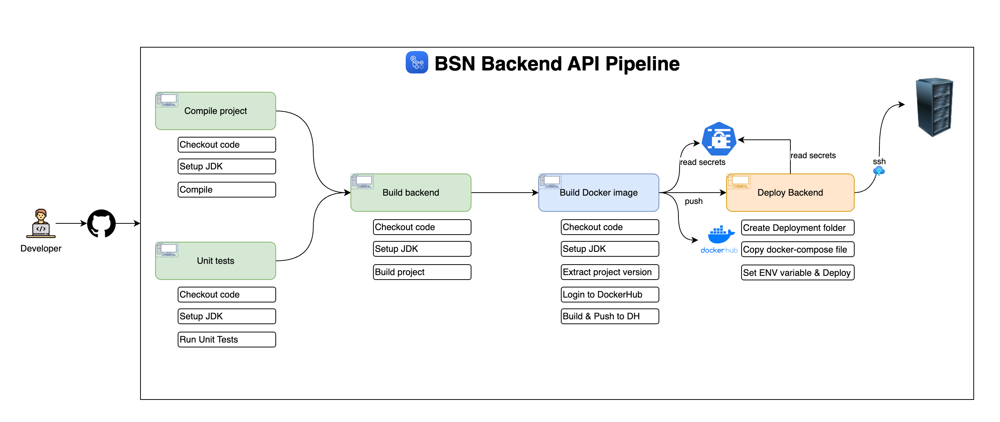

# Book Social Network

### "A backend application that utilizes Spring Boot 3 and Spring Security 6."

## Overview

-   The project itself a server-side project that enables users to manage their book collections and engage with a community of book enthusiasts. It offers features such as user registration, secure email validation, book management (including creation, updating, sharing, and archiving), book borrowing with checks for availability, book return functionality, and approval of book returns. The application ensures security using JWT tokens and adheres to best practices in REST API design. The backend is built with Spring Boot 3 and Spring Security 6.

## Features

-   **User Registration:** Users can register for a new account.
-   **Email Validation:** Accounts are activated using secure email validation codes.
-   **User Authentication:** Existing users can log in to their accounts securely.
-   **Book Management:** Users can create, update, share, and archive their books.
-   **Book Borrowing:** Implements necessary checks to determine if a book is borrowable.
-   **Book Returning:** Users can return borrowed books.
-   **Book Return Approval:** Functionality to approve book returns.

## Class Diagram


## Spring Security Diagram


## Backend Pipeline



## Technologies Used

-   Spring Boot 3
-   Spring Security
-   JWT Token Authentication
-   Spring Data JPA
-   JSR-303 and Spring Validation
-   OpenAPI and Swagger UI Documentation
-   Docker
-   Github Actions
-   Keycloak

## Learning Objectives

-   Designing a class diagram from business requirements
-   Securing a Spring Boot application using JWT token with Spring Security
-   Registering users and validating their accounts via email
-   Utilizing inheritance with Spring Data JPA
-   Implementing the service layer and handling application exceptions
-   Object validation using JSR-303 and Spring Validation
-   Handling custom exceptions
-   Implementing pagianation and REST API best practices
-   Using Spring Profiles for environment-specific configurations
-   Documenting APIs using OpenAPI and Swagger UI
-   Dockerizing the infrastructure
<!-- - CI/CD pipeline & deployment -->

## Setup Instructions

To set up the project, follow these steps:

1. **Clone the repository**
    ```bash
    git clone https://github.com/CAPELLAX02/book-social-network.git
    ```
2. **Run the `docker-compose.yml` file**

    ```bash
    sudo docker compose up -d
    ```

3. **Navigate to the project directory**
    ```bash
    cd book-social-network
    ```
4. **Install dependencies (assuming Maven is installed)**

    ```bash
    mvn clean install
    ```

5. **Run the Spring Boot application:**

   ```bash
   mvn spring-boot:run
   ```

## Contributing

-   All contributions are welcome! Just fork the repo, make some changes, and open up a pull request.

